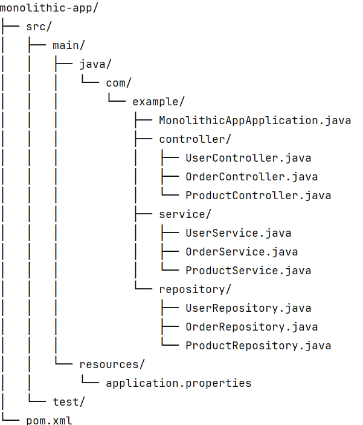
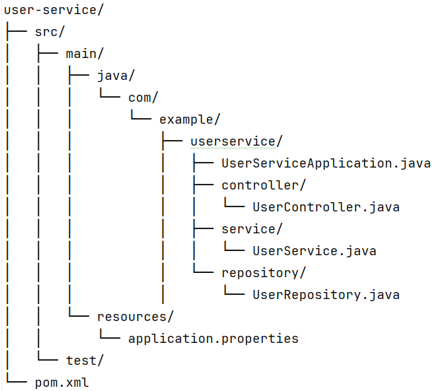

**Monolithic Application Overview**
In the monolithic application, you might have a single Spring Boot project with the following structure:

**Microservices Architecture**
In the microservices architecture, we will split the monolithic application into three 
separate Spring Boot projects. Each microservice will have its own database, and they will communicate 
with each other via REST APIs.

* UserService: Handles user-related operations.
* OrderService: Handles order-related operations.
* ProductService: Handles product-related operations.

**This is the structure of each Microservice:**

**Key Principles for Database Splitting**
* Database per Service:** Each microservice owns its database, and no other service can directly access it.
* Decentralized Data Management:** Each service manages its data independently.
* API Communication:** Services communicate via APIs (e.g., REST, gRPC) rather than directly accessing each other's databases.
* Data Consistency:** Use eventual consistency and distributed transactions (e.g., Saga pattern) if needed

We'll use H2 in-memory databases for simplicity, but the same principles apply to 
production databases like MySQL, PostgreSQL, etc.

**Insert test Data into database tables**
data.sql files with INSERT commands are provided for test data

**Communication Between Microservices**
* OrderService calls UserService to fetch user details using a REST API.
* OrderService does not directly access the UserService database. Instead, it uses the UserService API.

**Running the Example**
Start each microservice (UserService, OrderService, ProductService).
Use the H2 console (enabled in application.properties) to inspect each database:
* UserService: http://localhost:8081/h2-console
* OrderService: http://localhost:8082/h2-console
* ProductService: http://localhost:8083/h2-console

**Test the APIs:**
* UserService: http://localhost:8081/users/1
* OrderService: http://localhost:8082/orders/1
* ProductService: http://localhost:8083/products/1

**API Documentation with SpringDoc OpenAPI**

* User Service: http://localhost:8081/swagger-ui/index.html
* Product Service: http://localhost:8083/swagger-ui/index.html
* User Service: http://localhost:8082/swagger-ui/index.html

**API Gateway**

Adding an API Gateway to the microservices architecture is a common practice to provide 
a single entry point for clients, handle cross-cutting concerns (s.below) 
and route requests to the appropriate microservices.

* **Single Entry Point**: Clients interact with the API Gateway instead of individual microservices.
* **Routing**: The API Gateway routes requests to the appropriate microservice.
* **Cross-Cutting Concerns**: Centralized handling of authentication, logging, rate limiting, etc.
* **Load Balancing**: Distribute traffic across multiple instances of a microservice.
* **Security**: Hide internal microservices from external clients.

**Use the API Gateway to route requests to the microservices:**
* http://localhost:8080/users/1
* http://localhost:8080/orders/1
* http://localhost:8080/products/1

**Eureka Service Discovery**
* Eureka is a service registry (part of Spring Cloud Netflix) that helps microservices locate and communicate with 
  each other dynamically without hardcoding IP addresses or hostnames.
* When you have multiple microservices that need to discover each other dynamically.
* When services scale up/down (e.g., Kubernetes, cloud deployments).
* Health Monitoring (Heartbeats): Microservices send periodic heartbeats (~30s by default). If a service 
  fails to send heartbeats, Eureka marks it as DOWN and removes it from the registry.
* To enable Service Discovery with Eureka, set up a Eureka Server and configure the microservices
  (UserService, OrderService, and ProductService) to register themselves with the Eureka Server.

  
**Eureka Server Configuration**
1. Dependencies:Eureka Server and Spring Web (vulnerability cam be ignored in the last version)
2. Annotation in the main class: @EnableEurekaServer
3. Configuration in application.properties 
4. Start the Eureka Dashboard: http://localhost:8761

**Eureka Client Configuration**
1. Dependencies: Eureka Discovery Client, Actuator (Optional for metrics) (vulnerability cam be ignored in the last version)
2. Annotation in main class: @EnableEurekaClient 
3. Configuration in application.properties (service-name and route to Eureka server)
4. start the service and find the registration at the Eureka Dashboard

Open the Eureka Dashboard at to see the registered services:
* http://localhost:8761

**Eureka Server and API Gateway**

When a client sends a service request to the Gateway, the API Gateway:
1. Queries Eureka for service instances
2. Chooses one (with load balancing)
   _lb://order-service means “use LoadBalancer to pick an instance of order-service from Eureka”_
3. Forwards the request

Use the API Gateway to route requests to the microservices:
* http://localhost:8080/users/1
* http://localhost:8080/orders/1
* http://localhost:8080/products/1

**Summary**
* Eureka Server: Acts as the service registry.
* Eureka Client: Microservices register themselves with the Eureka Server using @EnableDiscoveryClient.
* API Gateway: Uses Eureka to dynamically route requests to the appropriate microservices.
* Service Names: Each microservice has a unique name (spring.application.name) used for discovery.
* Together, they enable scalable, resilient, and secure microservices communication

